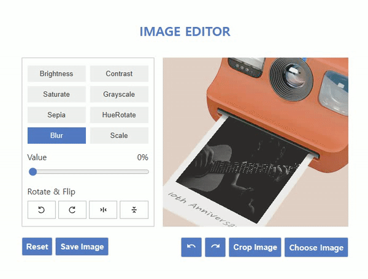
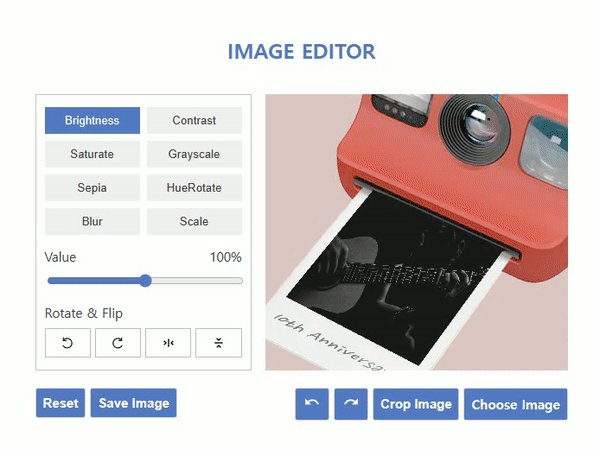

# 이미지 편집기
이미지를 편집할 수 있습니다. 밝기, 대비 등 사진이나 이미지에 필터를 적용할 수 있어요. 또한, 자르기, 뒤집기, 회전 등 스케일 변화도 가능합니다.   

만약, 필터와 스케일 변화를 초기화하고 싶나요? Reset 버튼을 누르면 모든 내용이 초기화가 됩니다.   

필터와 스케일을 모두 적용했다면 저장하고 싶을 겁니다. Save 버튼으로 변화된 이미지나 사진을 저장할 수 있습니다.   

 

## 구동 화면

